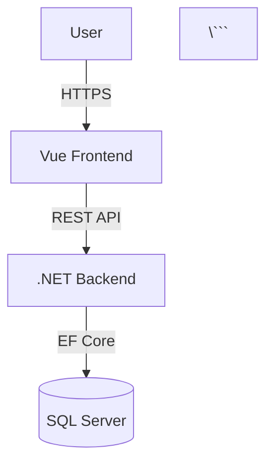

# Architecture Documentation

## C4 Model

This project uses the **C4 Model** to document system architecture. C4 was created by Simon Brown and is widely used in enterprise teams as a lightweight, structured way to describe system architecture at four levels of detail.

## The Four Levels

The C4 model provides a hierarchical way to describe architecture:

### Level 1: Context
**File:** `c4-context.md`

Shows the system in its environment — who uses it and what external systems it interacts with.

**Focus:** Big picture — users and external dependencies

### Level 2: Container
**File:** `c4-container.md`

Shows the high-level technical building blocks (applications, databases, file systems) and how they communicate.

**Focus:** Frontend, Backend, Database, and other deployable units

### Level 3: Component
**File:** `c4-component.md`

Zooms into a container to show its internal components and their responsibilities.

**Focus:** Internal structure of each container (e.g., controllers, services, repositories in the backend)

### Level 4: Code *(optional, not used in this project)*

Shows how a component is implemented (class diagrams, etc.). Usually code itself is sufficient documentation at this level.

## Why Mermaid?

There are two common ways to write C4 diagrams:

### Structurizr DSL (Professional Choice)
- **Pros:** Purpose-built for C4, supports all four levels, generates multiple views from a single model
- **Cons:** Requires dedicated renderer (Structurizr CLI or local server), adds tooling overhead

### Mermaid (Our Choice)
- **Pros:** Zero-friction rendering, works natively in GitHub and VS Code, widely adopted
- **Cons:** Not C4-native, limited to Context/Container/Component levels

This project uses **Mermaid** for its ease of use and broad compatibility. The slight trade-off in C4 fidelity is acceptable for the benefit of immediate rendering without external tools.

## File Naming

```
c4-{level}.md
```

Examples:
- `c4-context.md`
- `c4-container.md`
- `c4-component.md`

## Example Structure

```markdown
# C4 Container Diagram



## When to Update

Update architecture diagrams when:
- Adding new containers (applications, databases)
- Adding new external dependencies
- Changing how components communicate
- Refactoring component responsibilities
