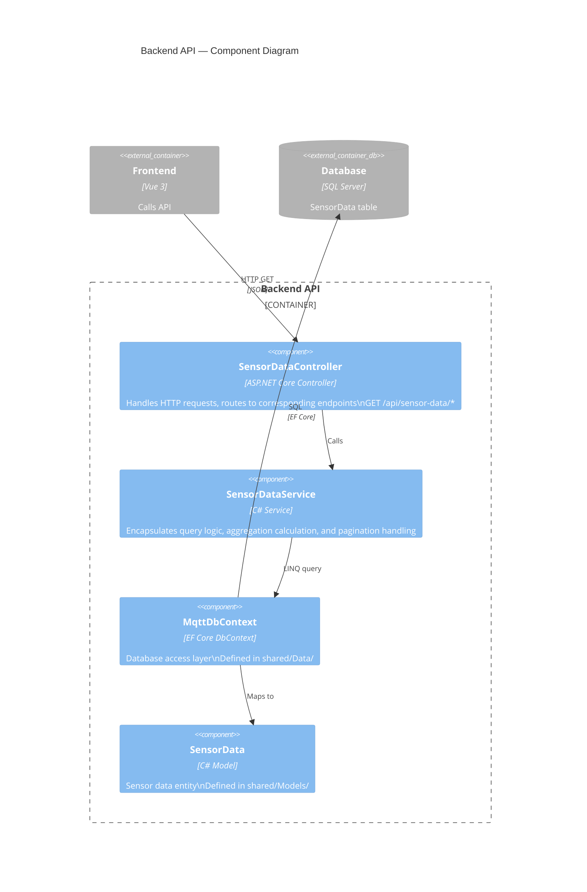
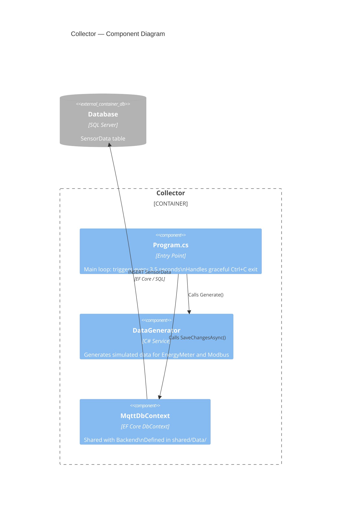
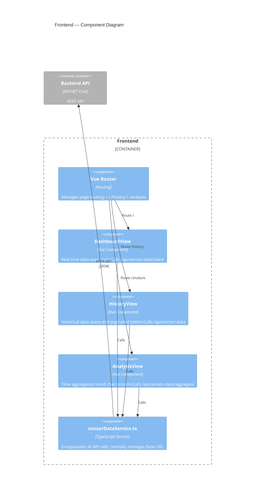

# C4 — Component Diagram

Expands the internal component structure of each container.

---

## Backend API Components

> `SensorDataService` is not yet created and needs to be implemented.

---

## Collector Components

---

## Frontend Components

> Frontend components are not yet implemented (App.vue is empty), vue-router needs to be installed first.

---

## Data Model

### SensorData (`shared/Models/SensorData.cs`)

| Field | C# Type | SQL Type | Nullable | Description |
|-------|---------|----------|----------|-------------|
| `Id` | `int` | `int IDENTITY(1,1)` | No | Primary key |
| `DeviceType` | `string` | `nvarchar(max)` | No | `EnergyMeter` / `Modbus` |
| `BleAddress` | `string` | `nvarchar(max)` | No | MAC address |
| `Current` | `double` | `float` | No | Current (A) |
| `Voltage` | `double` | `float` | No | Voltage (V) |
| `Watt` | `double` | `float` | No | Power (W) |
| `PowerFactor` | `double?` | `float` | Yes | Power factor |
| `Frequency` | `double?` | `float` | Yes | Frequency (Hz) |
| `Timestamp` | `DateTime` | `datetime2` | No | Measurement time |
