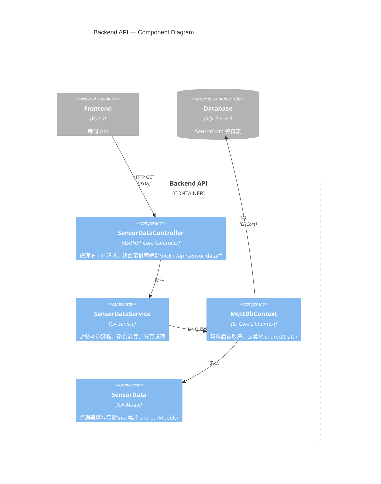
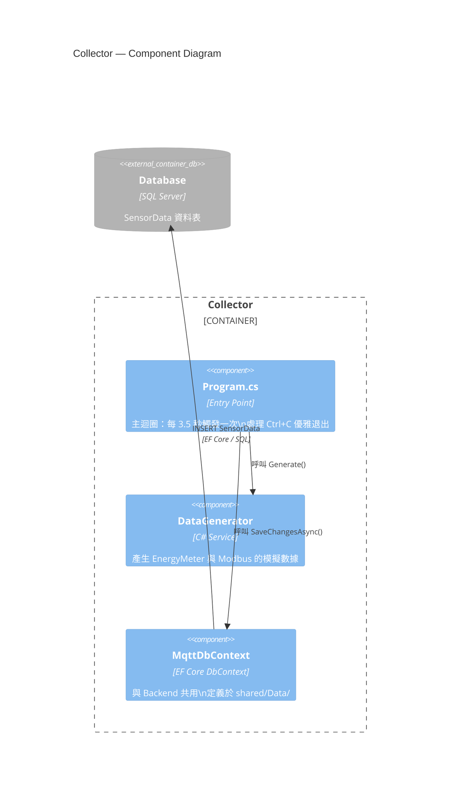
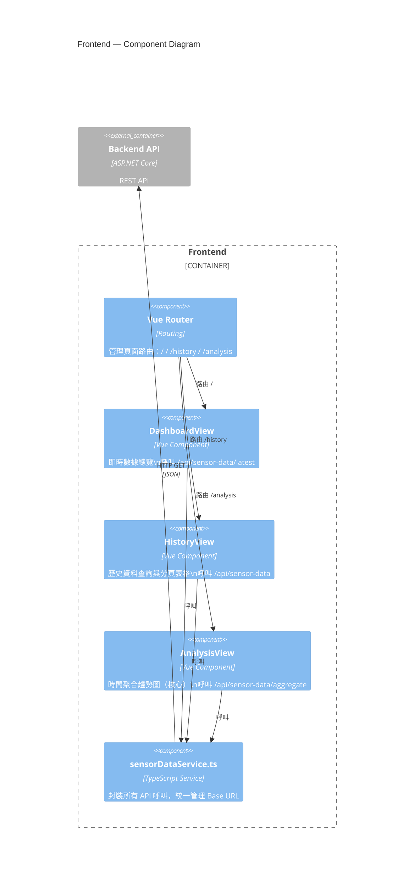

# C4 — Component Diagram

展開各容器的內部元件結構。

---

## Backend API 元件

> `SensorDataService` 目前尚未建立，需實作。

---

## Collector 元件

---

## Frontend 元件

> Frontend 元件目前尚未實作（App.vue 為空），需安裝 vue-router 後實作。

---

## 資料模型

### SensorData（`shared/Models/SensorData.cs`）

| 欄位 | C# 型別 | SQL 型別 | Nullable | 說明 |
|------|---------|----------|----------|------|
| `Id` | `int` | `int IDENTITY(1,1)` | 否 | 主鍵 |
| `DeviceType` | `string` | `nvarchar(max)` | 否 | `EnergyMeter` / `Modbus` |
| `BleAddress` | `string` | `nvarchar(max)` | 否 | MAC 位址 |
| `Current` | `double` | `float` | 否 | 電流 (A) |
| `Voltage` | `double` | `float` | 否 | 電壓 (V) |
| `Watt` | `double` | `float` | 否 | 功率 (W) |
| `PowerFactor` | `double?` | `float` | 是 | 功率因數 |
| `Frequency` | `double?` | `float` | 是 | 頻率 (Hz) |
| `Timestamp` | `DateTime` | `datetime2` | 否 | 量測時間 |
