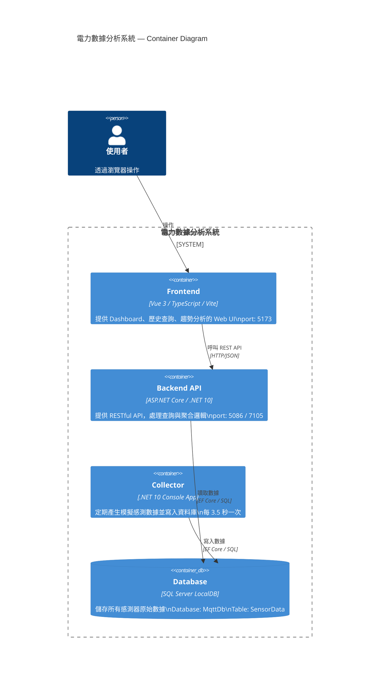

# C4 — Container Diagram

展開系統邊界，顯示各容器（可獨立部署的單元）及其互動。



---

## 容器說明

| 容器 | 技術 | 職責 |
|------|------|------|
| Frontend | Vue 3 + Vite | Web UI，呼叫 Backend API 顯示數據 |
| Backend API | ASP.NET Core | 提供查詢、篩選、時間聚合 API |
| Collector | .NET Console | 模擬感測器，定時寫入數據 |
| Database | SQL Server LocalDB | 持久化所有 SensorData |

## 關鍵資料流

```
Collector ──(每 3.5 秒寫入)──► Database
                                    │
                               Backend API ◄──(HTTP)──► Frontend ◄──(HTTPS)──► 使用者
```

## 部署備註

- Collector 與 Backend 共用 `shared/` 專案中的 `MqttDbContext` 與 `SensorData` 模型
- 開發環境下 Collector 與 Backend 可同時在本機執行，連到同一個 LocalDB
