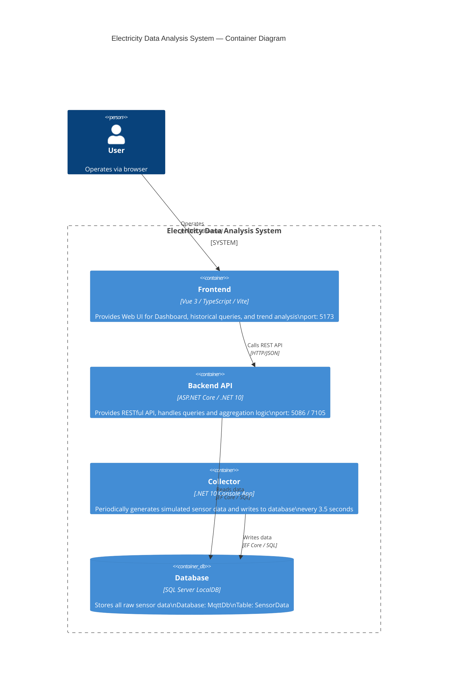

# C4 — Container Diagram

Expands the system boundary to show each container (independently deployable unit) and their interactions.



---

## Container Descriptions

| Container | Technology | Responsibility |
|-----------|------------|----------------|
| Frontend | Vue 3 + Vite | Web UI, calls Backend API to display data |
| Backend API | ASP.NET Core | Provides query, filtering, and time aggregation APIs |
| Collector | .NET Console | Simulates sensor, periodically writes data |
| Database | SQL Server LocalDB | Persists all SensorData |

## Key Data Flow

```
Collector ──(writes every 3.5s)──► Database
                                        │
                               Backend API ◄──(HTTP)──► Frontend ◄──(HTTPS)──► User
```

## Deployment Notes

- Collector and Backend share the `MqttDbContext` and `SensorData` model from the `shared/` project
- In the development environment, Collector and Backend can run simultaneously on the local machine, connecting to the same LocalDB
