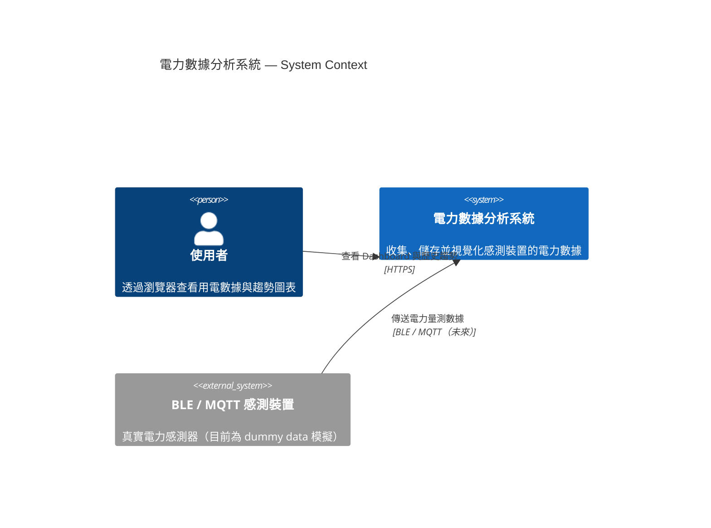

# C4 — Context Diagram

系統層級的最高視角，顯示本系統的邊界與外部互動者。

---

## 說明

| 元素 | 類型 | 說明 |
|------|------|------|
| 使用者 | Person | 主要操作者，透過瀏覽器存取系統 |
| 電力數據分析系統 | System（本系統） | 包含前端、後端 API、資料庫、Collector |
| BLE / MQTT 感測裝置 | External System | 真實量測裝置，目前以 Collector dummy data 替代 |

> 目前 Collector 在本機直接寫入資料庫，不透過 MQTT Broker。
> 未來若接入真實裝置，會新增 MQTT Broker 作為中介層。
