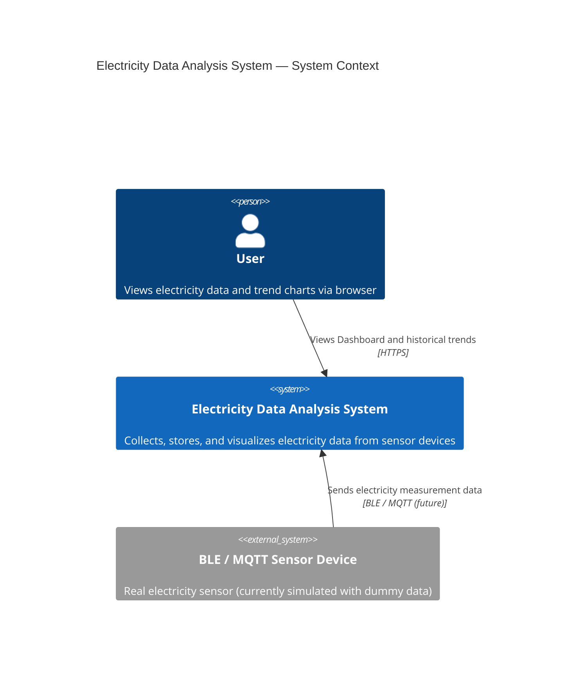

# C4 — Context Diagram

The highest-level view of the system, showing the system boundary and external actors.

---

## Description

| Element | Type | Description |
|---------|------|-------------|
| User | Person | Primary operator, accesses the system via browser |
| Electricity Data Analysis System | System (this system) | Includes frontend, backend API, database, and Collector |
| BLE / MQTT Sensor Device | External System | Real measurement device, currently replaced by Collector dummy data |

> Currently, the Collector writes directly to the database locally without going through an MQTT Broker.
> If real devices are connected in the future, an MQTT Broker will be added as an intermediary layer.
